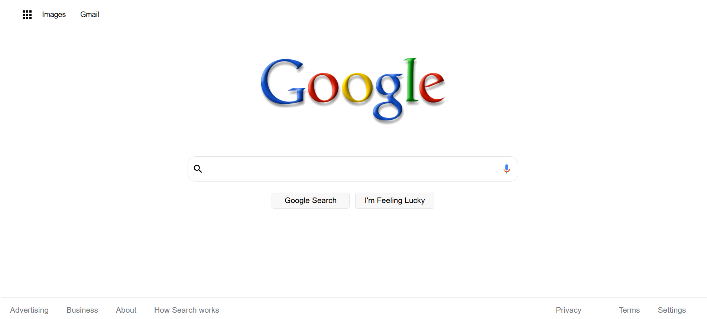

# Google Clone

This project is a simple Google search page clone that mimics the design and functionality of the Google homepage. The search bar includes buttons like "Google Search" and "I'm Feeling Lucky", as well as some footer links found on the original Google homepage. You can use this project to create your own Google search page.

## Features
- Google logo at the top
- Search bar that mimics Google search functionality
- "Google Search" and "I'm Feeling Lucky" buttons
- Footer with links like "Advertising", "Business", "About" and "Terms"
- Voice logo icon in search bar
- Responsive design for mobile and desktop

## Technologies Used
- HTML
- CSS

