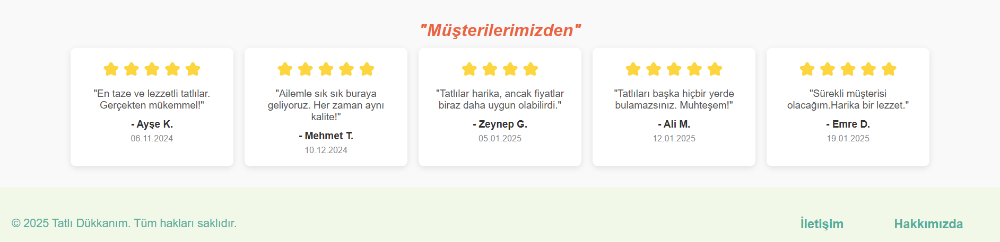

## Proje Özeti

Bu web sitesi, tatlı dükkanının tanıtımını yapmak amacıyla hazırlanmıştır. İçerik, ürünler, müşteri yorumları ve dükkanın sunduğu özellikler gibi bilgilerle zenginleştirilmiştir. Sitenin modern ve kullanıcı dostu bir tasarımı vardır.

### Sayfa Yapısı

1. **Anasayfa (index.html)**:
   - Tatlı Dükkanım hakkında kısa bir tanıtım.
   - Müşteri yorumları.

2. **Ürünler Sayfası (products.html)**:
   - Tatlılar hakkında detaylı bilgi.
   - Ürünlerin görselleri.

3. **Hakkımızda Sayfası (about.html)**:
   - Hakkımızda ve misyon yazısı.

4. **İletişim Sayfası (contact.html)**:
   - İletişim formu.

## Ekran Görüntüleri

Aşağıda sitenin ana sayfasının bazı ekran görüntüleri yer almaktadır. Bu resimler, sitenin temel tasarımıdır.

